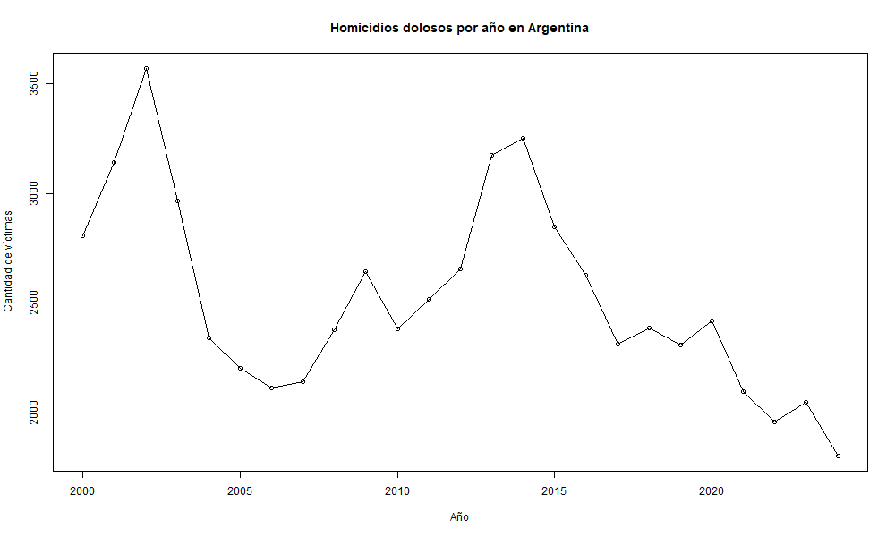

# Análisis de Homicidios en Argentina

Este proyecto analiza homicidios dolosos en Argentina utilizando R.

## Qué hace el script

- Carga un CSV
- Filtra homicidios dolosos
- Calcula víctimas por año
- Genera gráficos:
  - Evolución anual
  - Comparación masculino vs femenino
- Genera un resumen con el año con más y menos víctimas

## Archivos generados

- grafico.png
- grafico_sexo.png
- resumen.txt

## Cómo ejecutar

Abrir R en la carpeta del proyecto y ejecutar:

source("script.R")
## Gráfico
